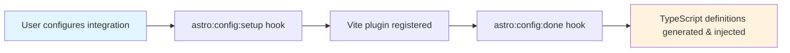
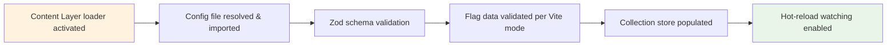
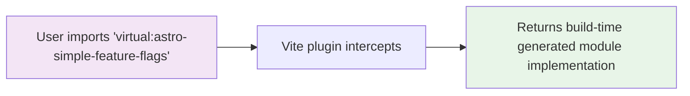
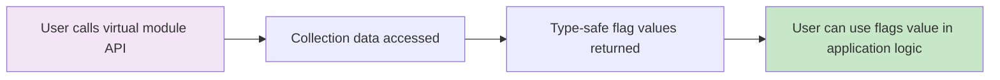

# CLAUDE.md

This file provides guidance to Claude Code (claude.ai/code) when working with code in this repository.

## Processing Flow Overview

### 1. Astro Build Start

### 2. Content Layer Loading

### 3. Virtual Module Resolution (Import-triggered)

### 4. Runtime Flag Access

## Library Architecture

### Core Components Flow

1. **Integration** (`src/integration.ts`) - Main Astro Integration
   - Hooks into `astro:config:setup` to inject Vite plugin
   - Hooks into `astro:config:done` to generate TypeScript definitions
   - Uses private hook to pass config to Content Layer loader

2. **Content Layer** (`src/content-layer.ts`) - Data Loading
   - Defines collection loader for `astro-simple-feature-flags` collection
   - Resolves and validates flag config files with config resolver from `src/config/resolve.ts`
   - Supports hot-reloading during development

3. **Virtual Module System** (`src/virtual-module/`)
   - `vite-plugin-flags-virtual-mod.ts` - Vite plugin for `virtual:astro-simple-feature-flags`
   - `index.ts` - Processing virtual module templates
   - `macro.ts` - Compile-time code generation using unplugin-macros
   - `templates/` - TypeScript definition and implementation templates

4. **Config Resolution** (`src/config/`)
   - Resolves flag config files using ESM resolver
   - Supports `.{js,cjs,mjs,ts,cts,mts}` extensions
   - Validates schema using Zod

## Development Commands

expected cwd: `packages/astro-simple-feature-flags/`

- `pnpm build` - Build with tsdown
- `pnpm test` - Run Vitest tests
- `pnpm lint` - Run ESLint
- `pnpm typecheck` - Run TypeScript type checking

## Development Notes

- Using build-time macros with `unplugin-macros` for code generation.
  - See `src/virtual-module/macro.ts` if detailed information needed.
- Config file resolution uses Node.js ESM resolution with jiti for TypeScript support
